# 🏘️ A:PATY 시연 시나리오

## 메인페이지

- 메인페이지에서는 A:PATY에 대한 설명과 특징을 읽어볼 수 있습니다.
- 'A:PARY 시작하기' 버튼을 눌러 회원가입을 진행합니다.

## 👏 회원가입

- 카카오 로그인 버튼을 눌러 카카오 계정 정보를 입력하고 소셜 로그인을 진행합니다.

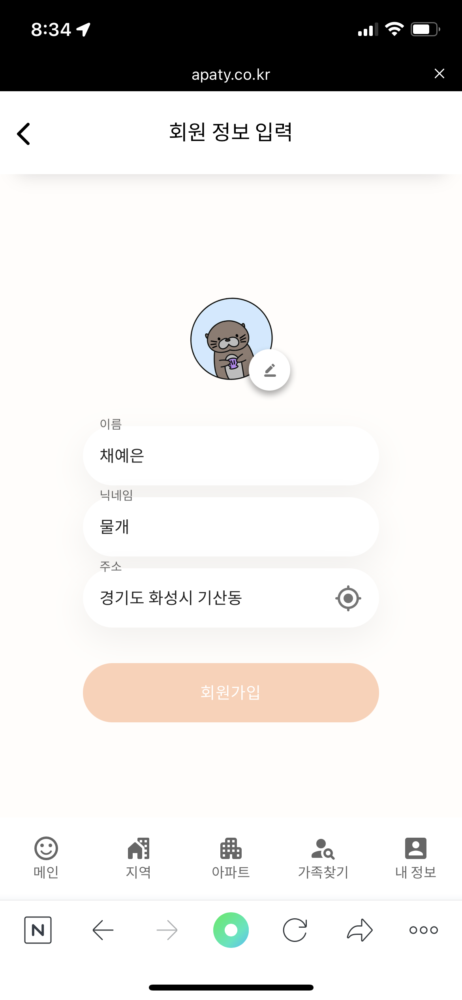

- 회원 정보 입력 페이지가 나옵니다. 이름, 닉네임을 입력합니다.
- 주소 입력창 오른쪽의 버튼을 클릭하면 현재 실시간 위치 기준으로 주소가 자동으로 입력됩니다. 
- 모든 정보를 입력했으면 회원가입 버튼을 눌러 회원가입을 완료합니다.

## 📱 로그인

- 다시 메인페이지에서 'A:PARY 시작하기' 버튼을 누르고 카카오 로그인을 누르면 '로그인이 완료되었습니다' 라는 안내가 뜹니다.

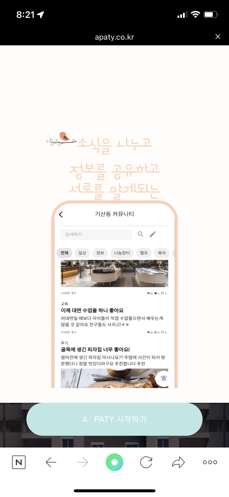

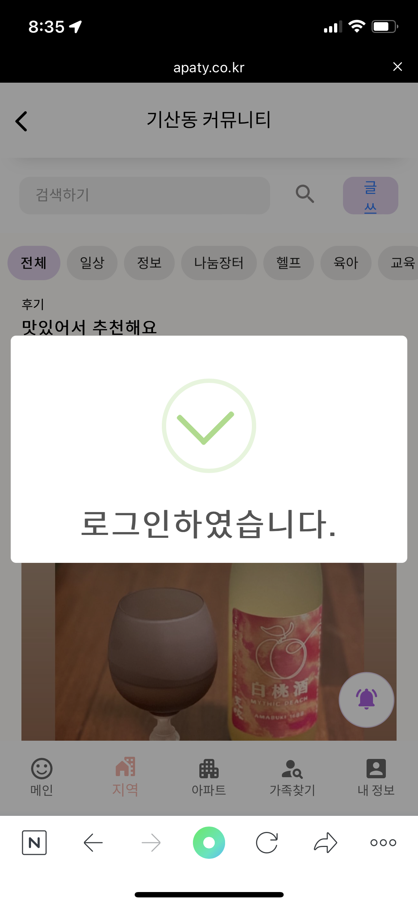

## 📫 커뮤니티

- 사용자가 사용할 수 있는 커뮤니티는 최소 1개, 최대 3개입니다. 지역 커뮤니티는 모든 사용자가 이용할 수 있고, 아파트에 사는 사용자는 고지서 인증을 통해 아파트 커뮤니티에 가입할 수 있습니다.

## 📍 지역 커뮤니티

- 지역 커뮤니티는 법정동 단위로 만들어진 동네 커뮤니티입니다. 
- 8개의 카테고리로 글을 작성하고, 필터링해 원하는 글을 카테고리별로 쉽게 찾아볼 수 있습니다.
- 스크롤을 내리면 무한스크롤이 되면서 새로운 글을 부드럽게 볼 수 있어요.

## 🏘️ 아파트 커뮤니티

- 아파트 커뮤니티를 이용하려면 고지서 사진을 첨부하고 동호수를 입력한 뒤 가입을 신청합니다.
- 관리자가 승인 요청을 보고 고지서와 주소를 확인해 승인합니다.

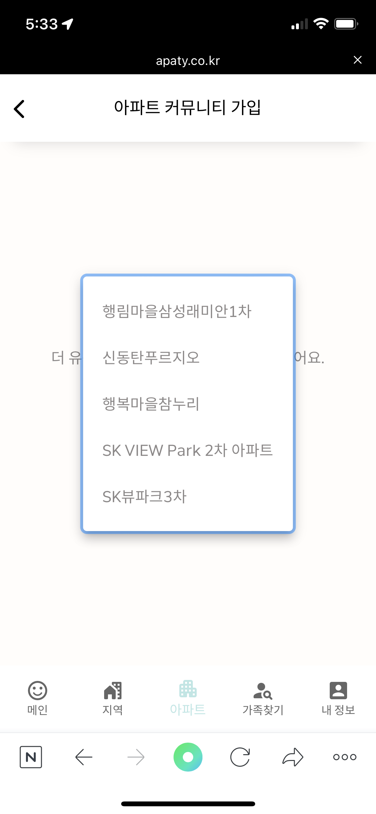

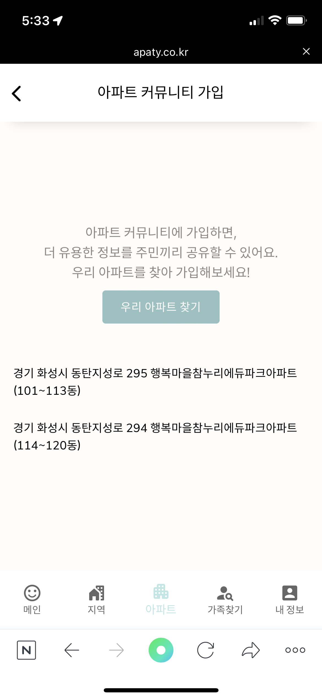

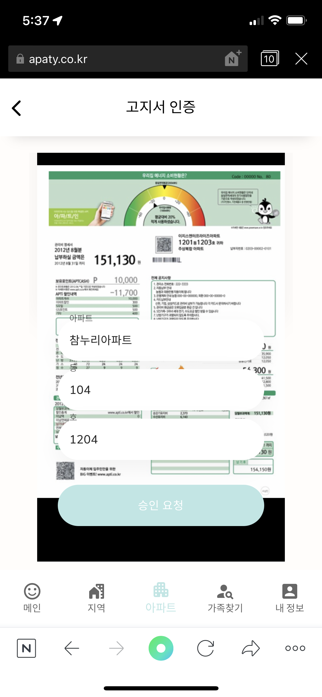

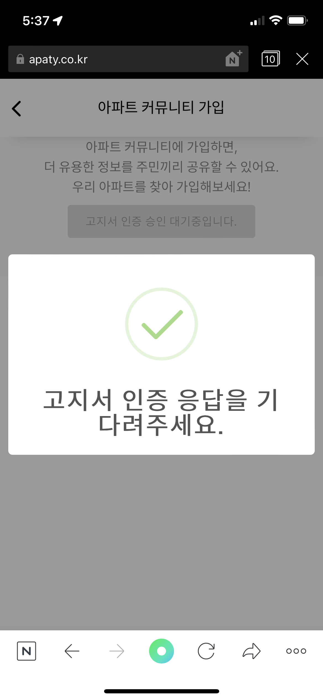

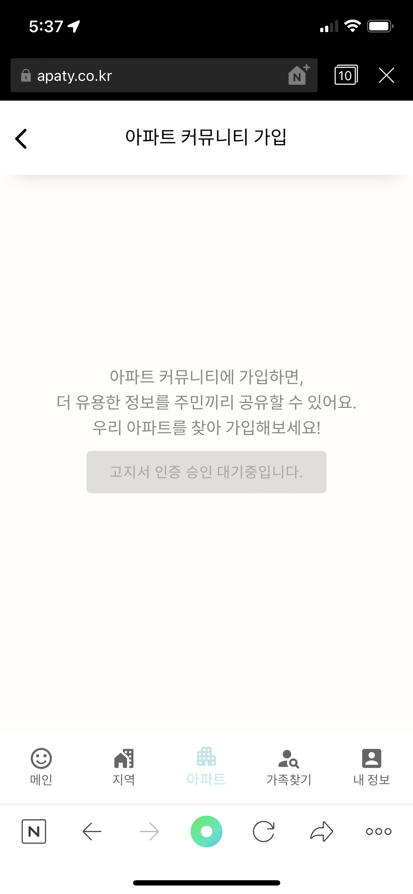

- 관리자가 승인하고 나면 아파트 커뮤니티를 이용할 수 있습니다.
- 아파트 커뮤니티는 같은 아파트 사람들끼리 소통할 수 있는 공간입니다. 전체소통과, 익명소통으로 나누어져 있습니다. 

### 😃 전체소통

- 전체 소통은 동호수를 밝혀 신뢰를 기반으로 소통하는 공간입니다.
- 8개의 카테고리로 글을 작성하고, 필터링해 원하는 글을 카테고리별로 쉽게 찾아볼 수 있습니다.

### 🤫 익명 소통

- 익명 소통에서는 실명으로는 말하기 어려운 민원성 글과 자유로운 소통을 위한 공간입니다. 
- 익명 소통에서 글을 작성하면 '책 읽는 돌고래' 처럼 랜덤의 닉네임으로 작성됩니다.

## 🏷️ 카테고리 필터링

- 지역 커뮤니티와 아파트 전체소통에서는 카테고리별로 원하는 글을 필터링해서 볼 수 있습니다.
- 카테고리 종류: 일상, 정보, 나눔장터, 헬프, 육아, 교육, 공구, 후기
- 카테고리를 클릭하면 해당 카테고리로 필터링됩니다.

## 📝 글 작성

- 지역 커뮤니티, 아파트 전체소통에서는 총 8개의 카테고리로 글을 작성할 수 있습니다.

- 이 중 나눔장터, 헬프, 공구는 필요에 따라 연락을 받을 전화번호와 마감여부를 입력할 수 있습니다. 
- 글과 관련된 사진을 최대 10개까지 첨부할 수 있습니다.

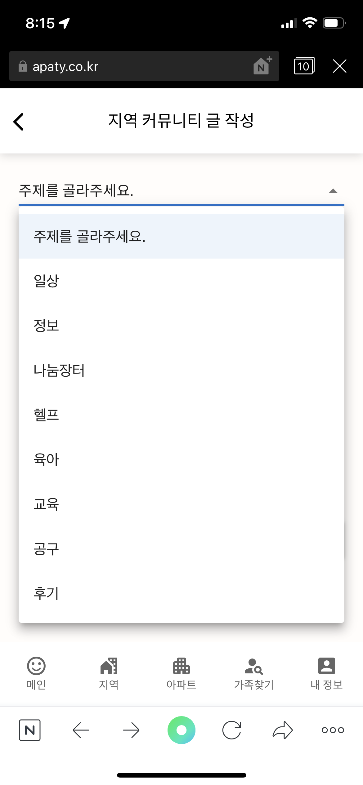

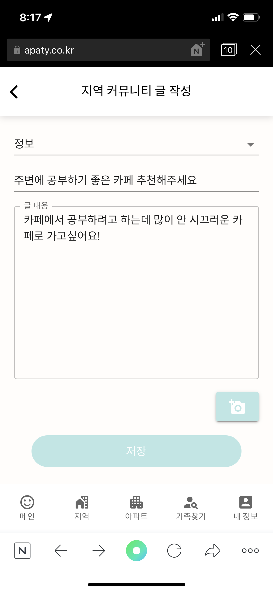

## ✒️ 글 수정/삭제

- 글 상세 페이지에서 연필 모양의 버튼을 눌러 글을 수정할 수 있고, 휴지통 버튼을 눌러 삭제할 수 있습니다.
- 제목, 내용, 전화번호, 마감여부, 첨부 이미지를 수정할 수 있습니다.

## 💬 댓글

- 글에는 댓글을 달며 사용자들과 소통할 수 있어요.
- 비밀 댓글로 작성하면 댓글 작성자와 글 작성자만 댓글을 볼 수 있어요.

## :mag: 검색

- 검색창에서 키워드를 입력하면 키워드가 들어있는 글을 검색할 수 있습니다.

## 📋 내 정보

- 내 정보 탭에서는 프로필 사진, 닉네임, 주소, 가족찾기 허용 여부, 가족찾기 범위를 설정할 수 있습니다.

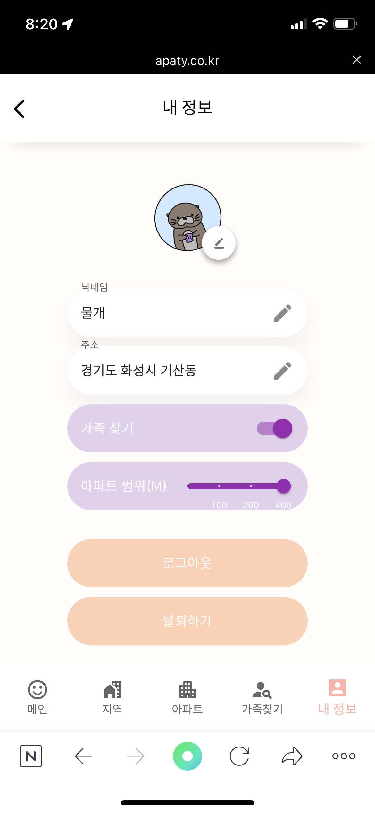

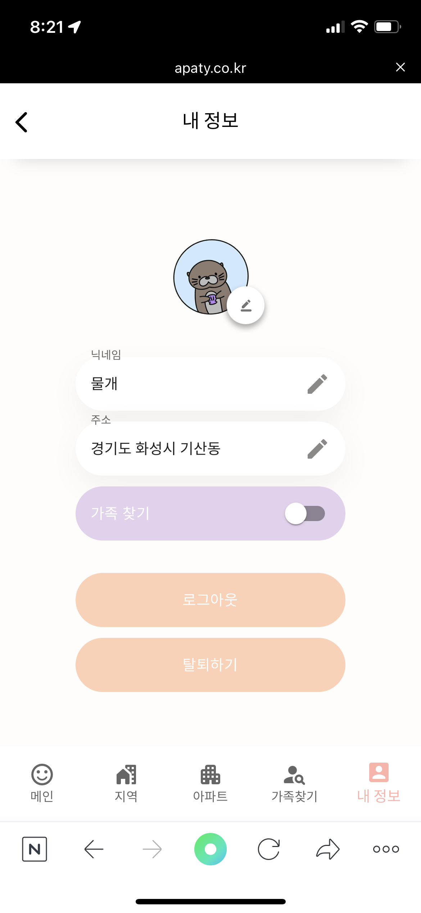

- 프로필 사진 변경을 누르면 기본 프로필 이미지들 중에서 선택하여 바꿀 수 있어요.

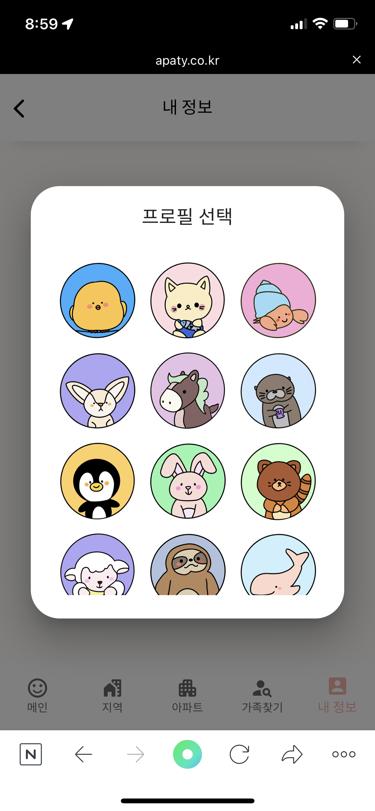

- 주소를 변경할 경우, 기존에 가입되었던 커뮤니티에서 탈퇴되니 주의해주세요!

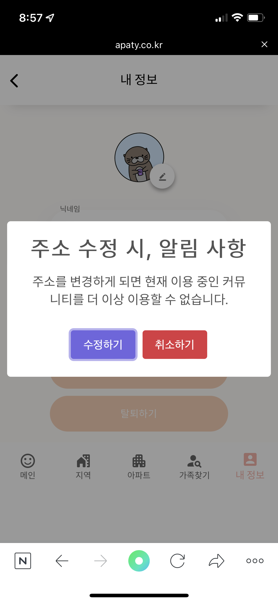

## 👨‍👩‍👧‍👦 가족 찾기

- 가족찾기 기능은 아파트 구역 내에 있는 우리 가족의 위치를 실시간으로 확인할 수 있는 기능입니다. 

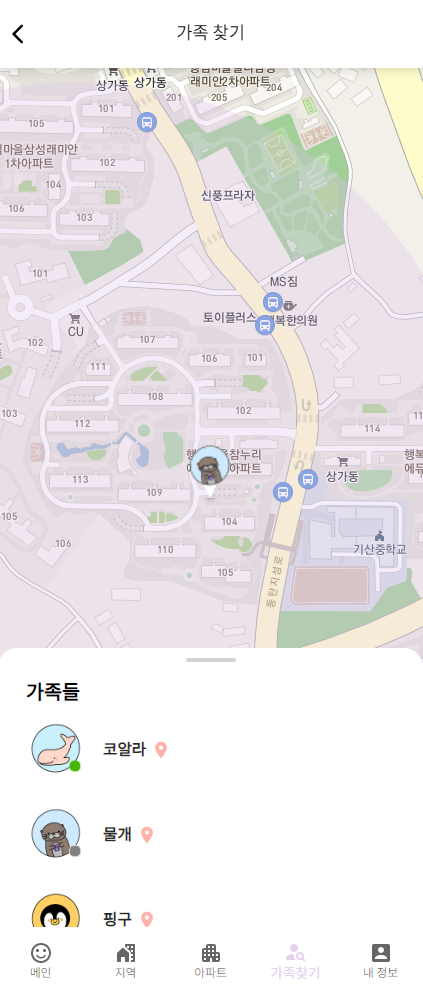

- 가족이 아파트 범위 안으로 들어오거나 범위 밖으로 나가면 우측 하단 종모양 버튼에 알림이 뜨고, 종을 누르면 알림 페이지로 이동합니다.

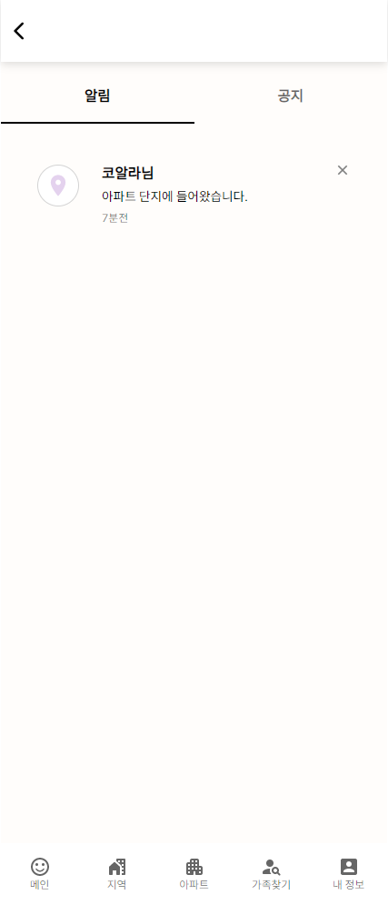

- 실시간으로 나의 위치와 가족의 위치를 확인할 수 있습니다.
- 가족찾기를 허용한 가족이 로그인해 있으면 프로필에 초록색 불이 들어옵니다.
- 실시간으로 변하는 움직임도 확인할 수 있습니다.